<h3><code>ansifra2ak@github ~ $ whoami</code></h3>

<table>
<tr>
<td valign="top" width="43%">

</td>

<td valign="top" width="57%">

</td>
</tr>
</table>

  

<h3><code>ansifra2ak@github ~ $ ./contributions.sh</code></h3>

  

<h3><code>ansifra2ak@github ~ $ ./links.sh</code></h3>

<b>Aspiring Data Scientist · MSc Data Science @ GITAM</b>

Python · SQL · NumPy · Pandas · Data Analysis

  

<code>Turning data into meaningful insights.</code>

